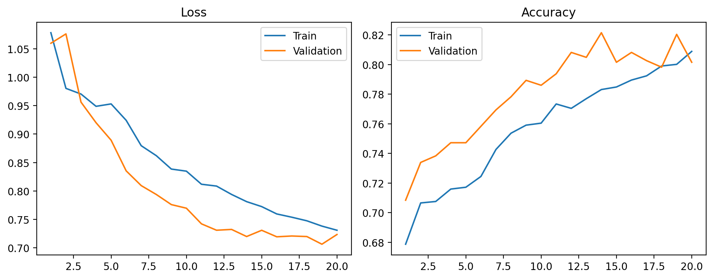
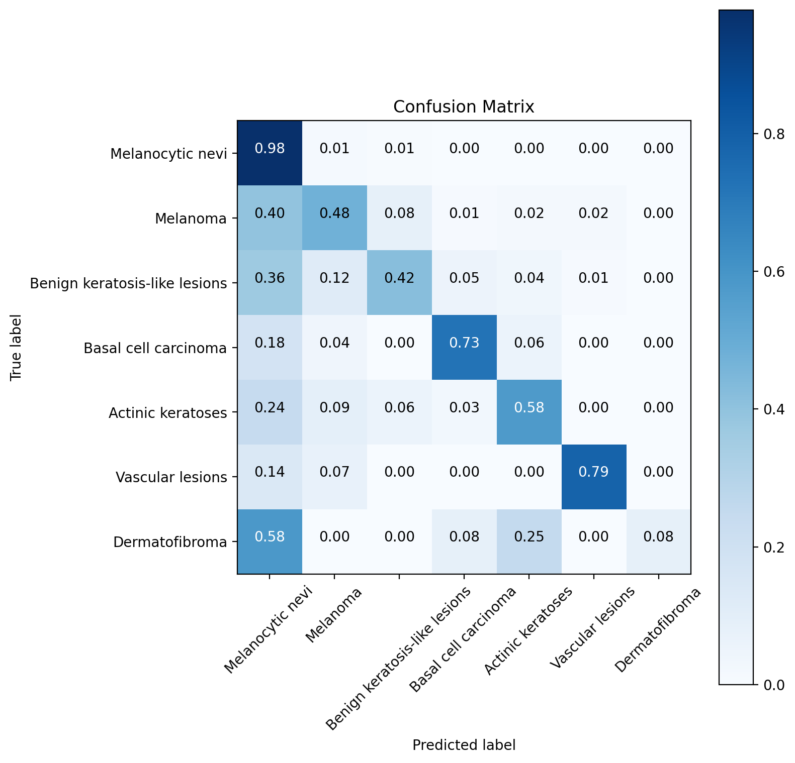
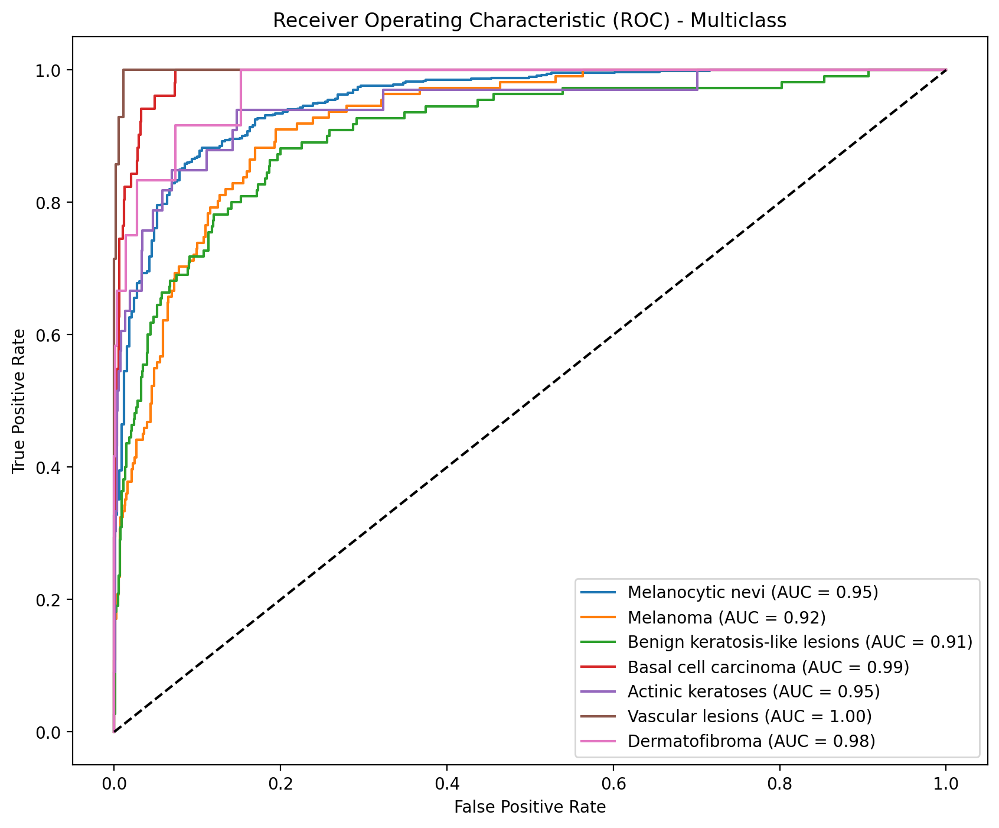
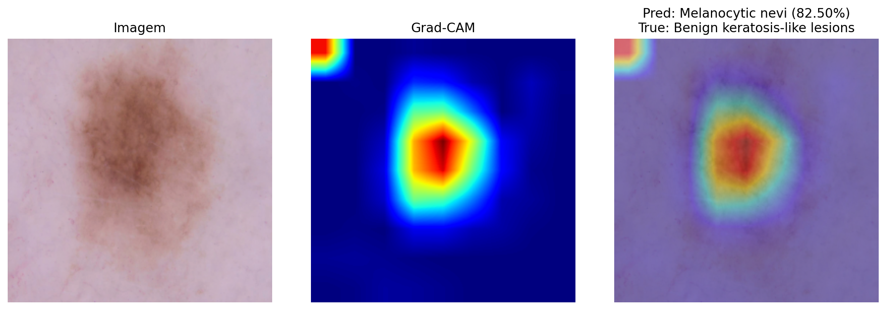
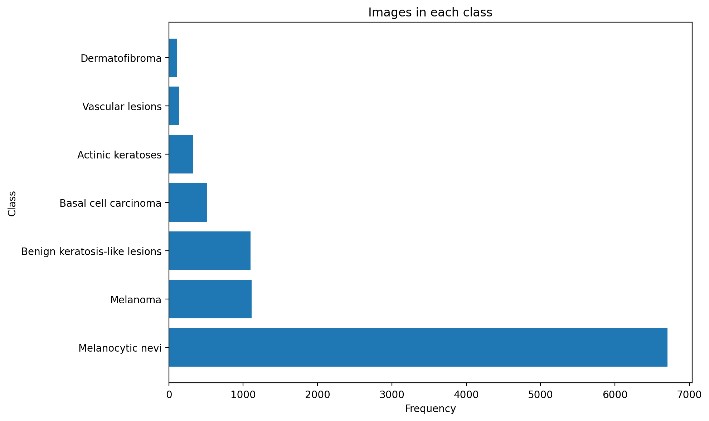

# EfficientNet Skin Lesion Classification

This repository contains a PyTorch pipeline for multiclass skin lesion classification using the HAM10000 dataset. The project was optimized to train on an NVIDIA GeForce GTX 1650 and uses a two-stage transfer learning strategy with EfficientNet-B2, fine-tuning, test-time augmentation, and Grad-CAM visualization.

> Educational/research portfolio project only. This model is not a medical device and must not be used for diagnosis or clinical decision-making.

## Portfolio Summary

- Problem: multiclass classification of dermatoscopic skin lesion images.
- Dataset: public HAM10000 dataset.
- Model: EfficientNet-B2 with transfer learning.
- Result: `82.24%` test accuracy in the current run.
- Explainability: Grad-CAM visualization for model attention inspection.
- Engineering focus: modular PyTorch training pipeline with reproducible configuration.

## Overview

The project now follows a modular structure. The entry point is:

- `train_skin_lesion_classifier.py`

This script acts as a thin launcher and delegates the full pipeline to the internal package:

- `skin_lesion_classifier/`

The pipeline includes:

- dataset preparation from HAM10000 metadata and images
- transfer learning with EfficientNet-B2
- two-stage training: classifier head training and backbone fine-tuning
- early stopping and learning rate scheduling
- test-time augmentation for evaluation
- confusion matrix, ROC curve, training history, and Grad-CAM visualization

## Project Architecture

The codebase was refactored into smaller modules to make the project easier to maintain, extend, and debug.

- `train_skin_lesion_classifier.py`
Entry point used to run the full training pipeline.

- `skin_lesion_classifier/config.py`
Centralizes training settings, paths, image size, learning rates, TTA, Grad-CAM flags, and model selection.

- `skin_lesion_classifier/data.py`
Handles dataset preparation, metadata loading, image path creation, transforms, custom `Dataset`, and `DataLoader` creation.

- `skin_lesion_classifier/model.py`
Defines model creation, classifier head replacement, freezing and unfreezing logic, and loss creation.

- `skin_lesion_classifier/train.py`
Contains the training loop, validation loop, TTA inference, checkpointing, evaluation, ROC generation, and end-to-end pipeline orchestration.

- `skin_lesion_classifier/utils.py`
Contains utilities for reproducibility, device configuration, plots, Grad-CAM, and general helper functions.

## Baseline Reference

This project uses as baseline the paper *An Interpretable Deep Learning Approach for Skin Cancer Categorization*, by Faysal Mahmud, Md. Mahin Mahfiz, Md. Zobayer Ibna Kabir, and Yusha Abdullah.

### Citation

```bibtex
@INPROCEEDINGS{10508527,
  author={Mahmud, Faysal and Mahfiz, Md. Mahin and Kabir, Md. Zobayer Ibna and Abdullah, Yusha},
  booktitle={2023 26th International Conference on Computer and Information Technology (ICCIT)},
  title={An Interpretable Deep Learning Approach for Skin Cancer Categorization},
  year={2023},
  pages={1-6},
  doi={10.1109/ICCIT60459.2023.10508527}
}
```

Paper link:

- [ResearchGate PDF](https://www.researchgate.net/publication/380199255_An_Interpretable_Deep_Learning_Approach_for_Skin_Cancer_Categorization)

## Dataset

This project uses the public HAM10000 dataset:

- [HAM10000 on Harvard Dataverse](https://dataverse.harvard.edu/dataset.xhtml?persistentId=doi:10.7910/DVN/DBW86T)

Expected local files after download/extraction:

```text
.
|-- HAM10000_metadata.csv
|-- HAM10000_images_part_1.zip
|-- HAM10000_images_part_2.zip
`-- dataverse_files.zip
```

The training script can extract the dataset archives when they are present in the project root. Large dataset and model files are intentionally ignored by Git.

## Environment

Main environment used in this project:

- Python with PyTorch
- CUDA-enabled training on NVIDIA GeForce GTX 1650
- torchvision pretrained EfficientNet backbone

Install the Python dependencies with:

```powershell
python -m pip install -r requirements.txt
```

## Training Strategy

The training pipeline was configured to improve overall accuracy while remaining compatible with a 4 GB GPU:

1. Train only the classifier head for a few epochs.
2. Unfreeze the last backbone blocks and fine-tune with a lower learning rate.
3. Apply data augmentation during training.
4. Use early stopping to avoid unnecessary overfitting.
5. Use test-time augmentation during evaluation.

## Results

Current run summary:

- Best validation accuracy: `0.8215`
- Test accuracy: `0.8224`
- Backbone: `EfficientNet-B2`
- Input size: `260 x 260`

### Training History



### Confusion Matrix



### ROC Curve



### Grad-CAM Example



### Dataset Distribution



### Sample Images


## Repository Structure

```text
.
|-- train_skin_lesion_classifier.py
|-- skin_lesion_classifier/
|   |-- __init__.py
|   |-- config.py
|   |-- data.py
|   |-- model.py
|   |-- train.py
|   `-- utils.py
|-- README.md
|-- LICENSE.txt
|-- Resultados/
|   |-- resumo_resultados.txt
|   |-- training_history.png
|   |-- confusion_matrix.png
|   |-- roc_curve.png
|   |-- grad_cam_example.png
|   |-- frequency_plot.png
|   `-- sample_images.png
`-- .gitignore
```

## How to Run

After activating your virtual environment and placing the HAM10000 files in the project root:

```powershell
python .\train_skin_lesion_classifier.py
```

This command still works exactly the same as before, but internally the code now runs through the modular package structure above.

## Limitations

- The dataset is imbalanced across the seven lesion classes.
- The model was optimized for a 4 GB GPU, so the batch size and architecture choices prioritize local reproducibility.
- Accuracy alone is not enough for medical use; class-level recall, false negatives and clinical validation would be required in a real setting.
- Grad-CAM helps inspect attention regions, but it does not prove clinical correctness.

## License

This project is distributed under the terms described in [LICENSE.txt](LICENSE.txt).
