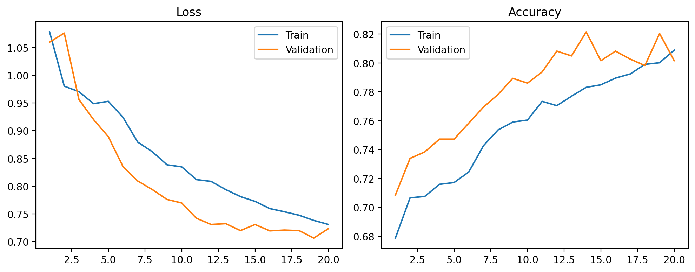
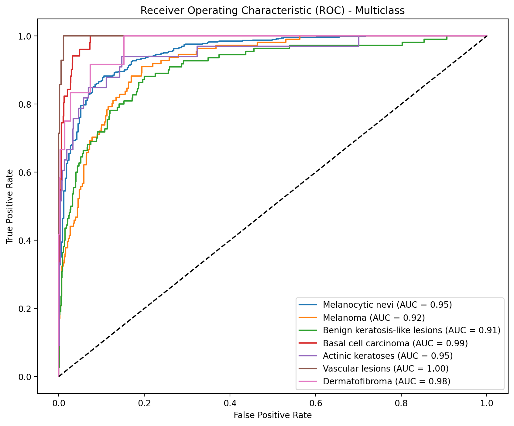
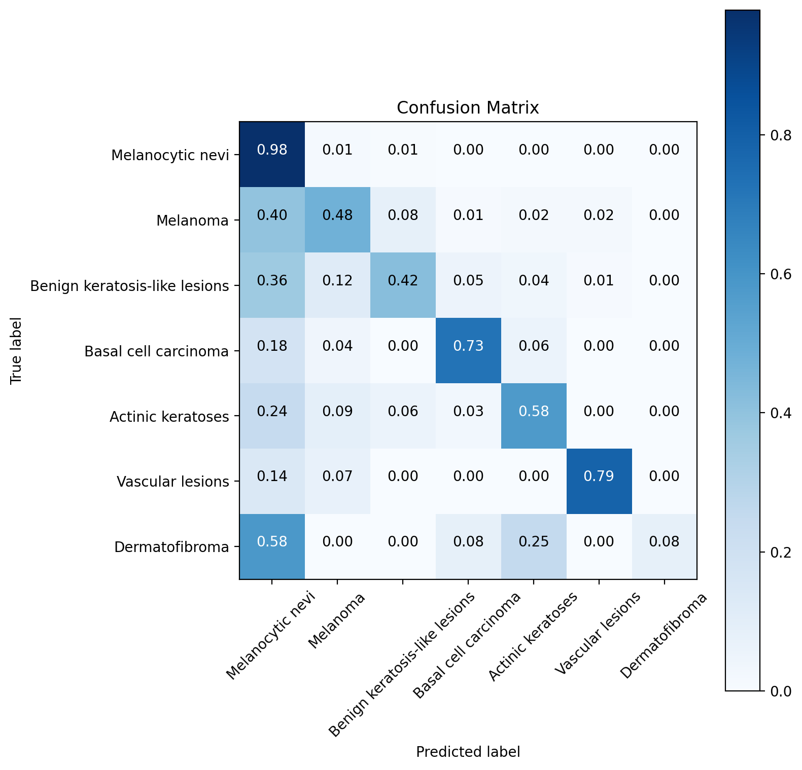
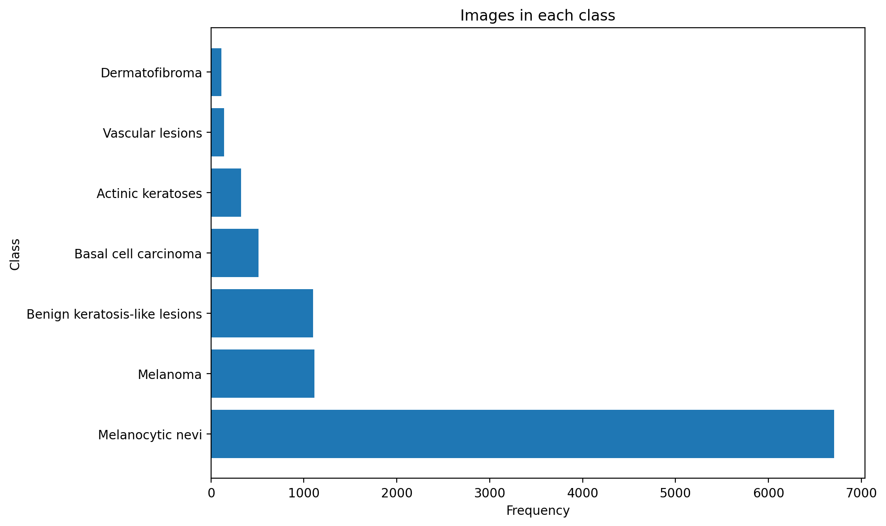
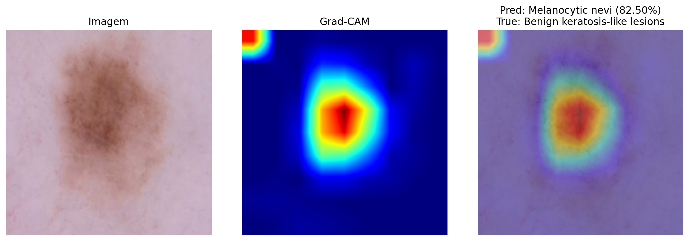

# 📊 Experimental Results & Training Metrics

> **Model:** EfficientNet-B2 (ImageNet Pre-trained)  
> **Dataset:** HAM10000 (10,015 Dermoscopic Images, 7 Classes)  
> **Test Accuracy:** `82.24%` (Isolated Holdout Test Set with TTA)

---

## ⚙️ Baseline Methodology & Hyperparameters

| Parameter | Specification |
| :--- | :--- |
| **Test Accuracy** | **82.24%** strictly evaluated on the isolated test set |
| **Dataset Split** | Stratified Holdout (70% Train / 15% Validation / 15% Test) |
| **Reproducibility Seed** | `seed = 42` (PyTorch, NumPy, Scikit-Learn) |
| **Hardware** | NVIDIA GeForce GTX 1650 (4 GB VRAM) — Local Environment |
| **Input Resolution** | $260 \times 260$ pixels (RGB) |
| **Training Strategy** | 2-Stage Fine-Tuning (5 epochs frozen + 15 epochs unfrozen) |
| **Optimizer** | AdamW ($\text{lr}_{\text{head}} = 10^{-3}$, $\text{lr}_{\text{backbone}} = 10^{-4}$, weight decay $= 10^{-4}$) |
| **Regularization** | Early Stopping (patience: 5, metric: `val_loss`), Weighted Cross-Entropy |
| **Augmentation** | Random horizontal/vertical flips, rotations, Test-Time Augmentation (TTA) |

---

## 📈 Model Performance & Convergence

| Training & Validation Curves | Multi-Class ROC Curves |
| :---: | :---: |
|  |  |
| *Loss and accuracy evolution across epochs* | *One-vs-Rest ROC curves and AUC per class* |

| Confusion Matrix | Dataset Imbalance Distribution |
| :---: | :---: |
|  |  |
| *Normalized test set confusion matrix* | *Sample count per diagnostic category* |

---

## 🔍 Model Interpretability & Qualitative Analysis

| Grad-CAM Visual Explanation | Dataset Sample Dermoscopy Images |
| :---: | :---: |
|  |  |
| *Gradient-weighted Class Activation Mapping (Grad-CAM)* | *Representative dermatoscopic lesions from HAM10000* |

